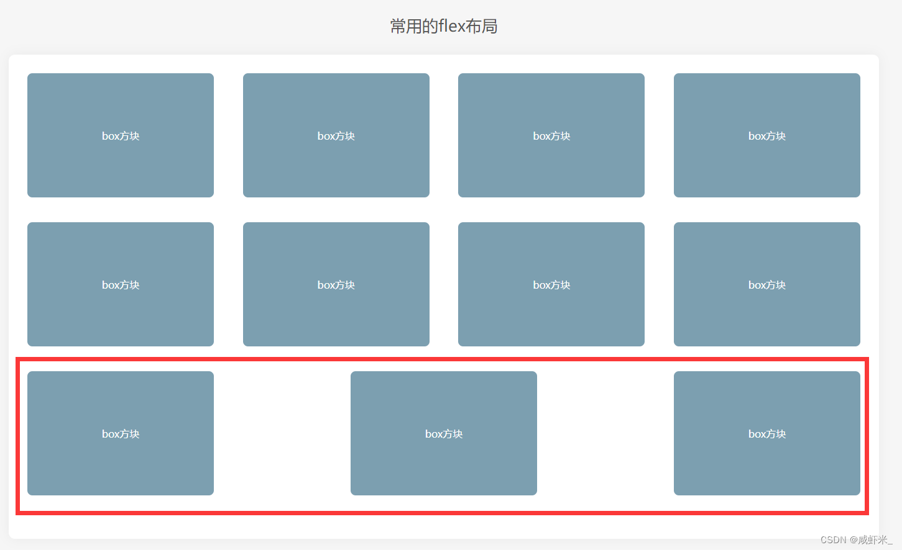
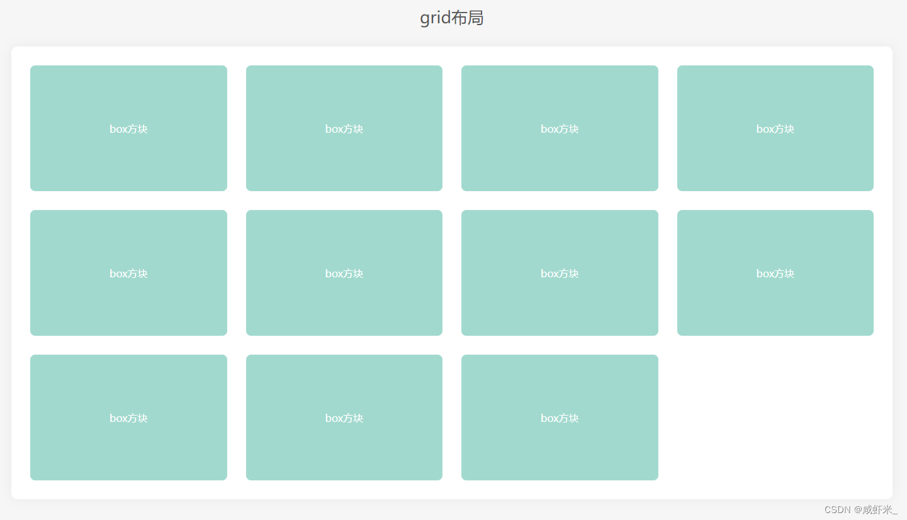
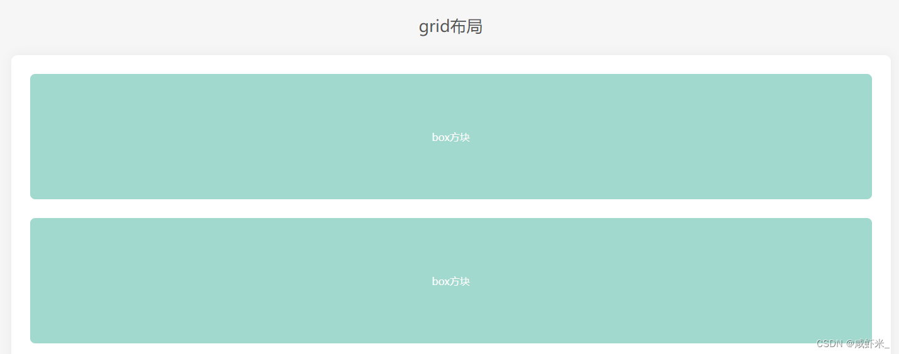
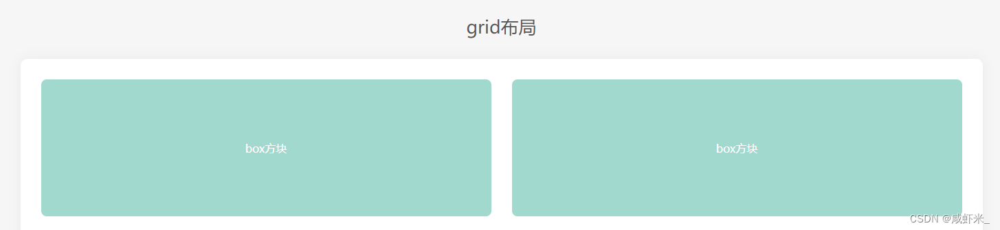
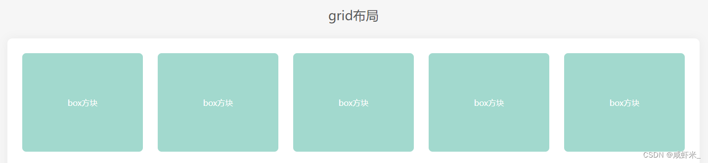
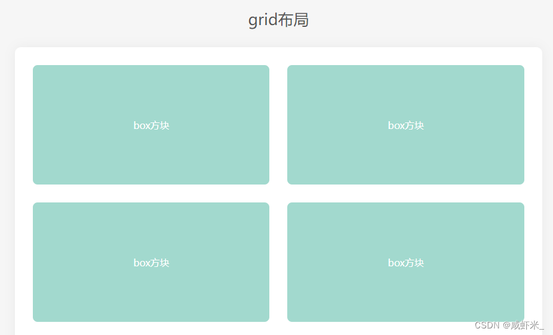
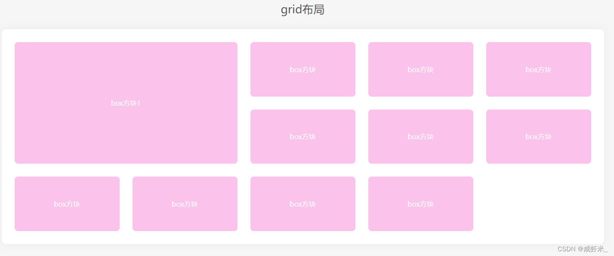

<!-- truncate -->

#### 使用flex布局的痛点 

如果使用justify-content: space-between;让子元素两端对齐，自动分配中间间距，假设一行4个，如果每一行都是4的倍数那没任何问题，但如果最后一行是2、3个的时候就会出现下面的状况：

``` 
/* flex布局 两端对齐 */ 
display: flex;
flex-wrap: wrap; 
justify-content: space-between;  
``` 

 

如何想让最后一行左对齐是有办法的，大家可以自行去搜索办法，能实现但是操作起来有些麻烦，但是**如果这种布局使用grid布局的话，就会变的非常容易**。 ### 同样的布局，将flex改为grid 

```
/* grid布局 两端对齐,最后一行左对齐*/

display: grid;
grid-template-columns: 1fr 1fr 1fr 1fr;
gap: 30px;   
```
解释一下上面的代码： * display：grid 是转为网格布局，这个是必须的 * grid-template-columns：1fr | px 这是将网格分为几列，1fr是自适配单位，可以当成栅格 * gap:30px 这是网格四周的间隔 _注意：这三个属性是给父容器添加的，子元素，可以不用设置宽度，也不用设置margin间距即可完成如下布局。_

 

看，上面的grip布局，最后一行不是4的倍数，但是可以左对齐，不会像flex布局一样的bug。 ### 深入了解一下grid-template-columns属性 * grid-template-columns: 1fr;（独占一行）

 

* grid-template-columns: 1fr 1fr;（一行分为两列）
*  
* grid-template-columns: 1fr 200px 1fr;（中间固定200px，两边自动平均分配）  
* grid-template-columns: 1fr 1fr 1fr 1fr 1fr;如果5列的值相同，可以使用repeat()函数，grid-template-columns: repeat(5,1fr)当然将1fr缓存固定的px尺寸也可以。  

* grid-template-columns: repeat(auto-fill, minmax(255px, 1fr)); 这种写法可以用来做响应式布局，auto-fill主轴上指定的宽度或者重复次数是最大可能的正整数，minmax最小值255px、最大值1fr代表剩余空间的比例。
*  
* 
* 注意：实现这种响应式布局，一定要注意父容器不能使用固定宽度，可以将父容器改为如：80%，这样就能根据屏幕的宽度，自动展示一行展示几个了。 


### grid-row和grid-column可以控制某个元素占领几份
```
.layout .box1{
 	grid-row: 1/3;
 	grid-column: 1/3;
}

```


* 以grid-row行为例，从第几列开始 / 第几列+想占几个； 
* 
* 


### 参考链接

- https://blog.csdn.net/qq_18798149/article/details/133872183
- 